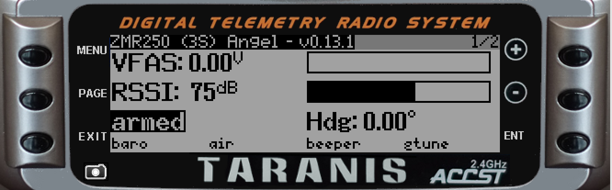
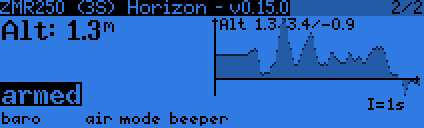

# telemetry
LUA script for opentx 2.1.x
written and tested with OpenTX/Companion 2.1.8
radio: FrSky Taranis plus
flight controller: SP3 Racing EVO

## Installation
* copy script into the TELEMETRY folder on the SD card

## Additional configuration
* the script allows to adjust the amount of cells using +/- in any screen

## Info
the telemetry values are based on cleanflight SP3 Racing EVO controller

## Pictures
# Page 1/2

# Page 2/2

