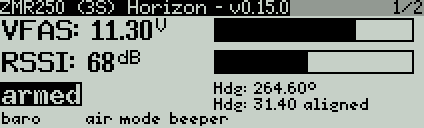

# telemetry script
LUA telemetry script for opentx 2.1.x/2.2.x written and tested with:
OpenTX/Companion 2.1.8/2.2.0
FrSky Taranis plus
SP3 Racing EVO

## Installation
* copy script into the TELEMETRY folder on the SD card

## Info
* the telemetry values are based on cleanflight SP3 Racing EVO controller
* it is possible to display as well named switch positions
* low and critical battery status is announced via voice
* non available telemetry values are not displayed and ignored

## Pictures
* Page 1/2:
display of VFAS and RSSI. In addition named switch positions and arm status

* Page 2/2:
display of  altitude (1 sec interval calibration). alt and vspd incl. the min and max values. The diagram shows the as well the min and max value of the displayed graph

